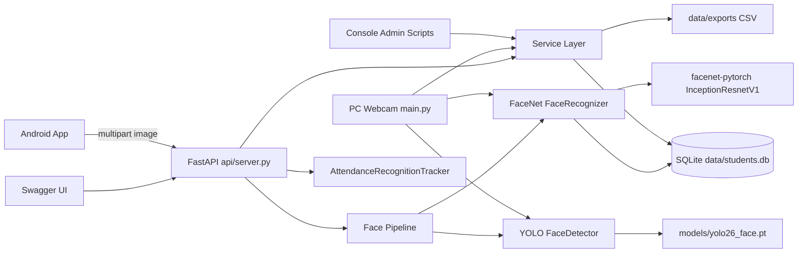
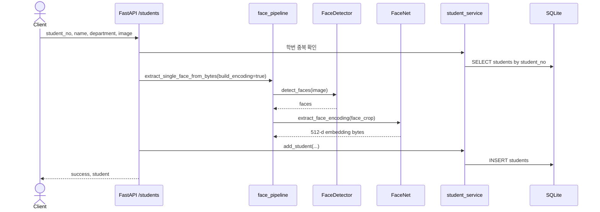
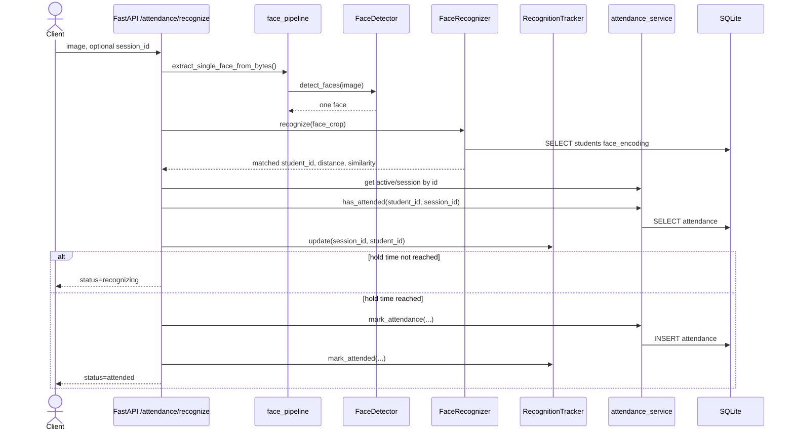
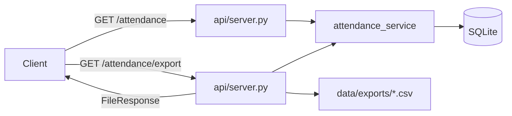

# 아키텍처 문서

작성일: 2026-06-02

## 1. 시스템 개요

이 프로젝트는 YOLO 기반 얼굴 검출, FaceNet 기반 얼굴 임베딩 비교, FastAPI 서버, SQLite 저장소를 결합한 출석 관리 MVP다.

주요 실행 경로는 두 가지다.

- Android 연동: Android 앱이 FastAPI 서버로 얼굴 이미지를 전송하고 서버가 출석을 처리한다.
- PC 웹캠 실행: `main.py`가 로컬 웹캠으로 얼굴을 인식하고 출석을 처리한다.

## 2. 구성도



## 3. 레이어별 책임

| 레이어 | 파일/디렉터리 | 책임 |
| --- | --- | --- |
| API | `api/server.py` | HTTP 요청/응답, multipart 업로드 처리, 세션/학생/출석 API 제공 |
| Android Client | `android_app/app/src/main/java/...` | 서버 헬스 체크, 활성 세션 조회, 얼굴 이미지 출석 요청, 출석 목록 조회 |
| PC Client | `main.py` | OpenCV 웹캠 캡처, 실시간 얼굴 인식 UI, 출석 처리 |
| Admin CLI | `admin/*.py` | 콘솔 기반 학생 등록, 학생 목록 조회, 출석 CSV 내보내기 |
| Face Pipeline | `modules/face_pipeline.py` | 이미지 디코딩, 단일 얼굴 검증, 얼굴 crop, 등록용 임베딩 생성 |
| Detection | `modules/detector.py` | YOLO 모델로 얼굴 bounding box 검출 |
| Recognition | `modules/recognizer.py` | FaceNet 임베딩 추출, 등록 얼굴과 거리/유사도 비교 |
| Attendance State | `modules/attendance_state.py` | 3초 유지 인식 상태를 서버 메모리에서 추적 |
| Services | `modules/student_service.py`, `modules/attendance_service.py` | 학생/세션/출석 비즈니스 로직 |
| Database | `modules/database.py` | SQLite 연결, 테이블 생성, 기존 스키마 마이그레이션 |
| Config | `config.py` | 경로, 모델, confidence, recognition threshold, hold time 설정 |

## 4. 주요 처리 흐름

### 4.1 학생 등록 흐름



등록 조건:

- 학번은 중복될 수 없다.
- 이미지에서 얼굴이 정확히 1개만 검출되어야 한다.
- `face_encoding`은 FaceNet 512차원 임베딩을 `numpy.save` 형태의 BLOB으로 저장한다.

### 4.2 출석 인식 흐름



핵심 정책:

- 출석 저장 전 같은 학생 얼굴이 같은 세션에서 3초 이상 유지되어야 한다.
- 인식 추적 상태는 프로세스 메모리에만 존재한다. 서버 재시작 시 초기화된다.
- 같은 `session_id + student_id`는 DB unique 제약으로 중복 저장되지 않는다.
- `session_id`가 요청에 없으면 활성 세션 기준으로 처리한다.

### 4.3 출석 조회 및 CSV 흐름



조회 기준:

- `session_id`가 있으면 해당 세션 출석 목록
- `date`가 있으면 해당 날짜 전체 출석 목록
- 둘 다 없으면 활성 세션 출석 목록

## 5. 모델 및 인식 설정

| 설정 | 현재 값 | 설명 |
| --- | --- | --- |
| `YOLO_MODEL_PATH` | `models/yolo26_face.pt` | 얼굴 검출 모델 |
| `FACE_DETECTION_CONFIDENCE` | `0.5` | YOLO 검출 confidence threshold |
| `FACE_RECOGNITION_MODEL` | `facenet-vggface2` | 설정상 모델명 |
| `FACENET_PRETRAINED_DATASET` | `vggface2` | 실제 FaceNet pretrained dataset |
| `FACE_RECOGNITION_THRESHOLD` | `1.0` | 등록 얼굴 매칭 거리 threshold |
| `ATTENDANCE_HOLD_SECONDS` | `3.0` | 출석 확정 전 유지 시간 |
| `TRACKER_TIMEOUT_SECONDS` | `5.0` | 추적 상태 만료 시간 |

`models/yolo26_face.pt`는 런타임 필수 파일이다. 현재 학습된 얼굴 검출 가중치를 사용할 때는
`runs/detect/runs/train/face_yolo_30ep/weights/best.pt`를 이 경로로 복사한다.
`yolo11n.pt`는 학습 시작점/base weight로만 사용한다.

## 6. 배포 및 실행 구조

FastAPI 서버:

```powershell
venv\Scripts\python.exe -m uvicorn api.server:app --host 0.0.0.0 --port 8000 --reload
```

PC 웹캠 출석:

```powershell
venv\Scripts\python.exe main.py
```

DB 초기화/마이그레이션:

```powershell
venv\Scripts\python.exe -m modules.database
```

학생 등록 CLI:

```powershell
venv\Scripts\python.exe -m admin.register_student
```

## 7. 현재 구조상 주의점

- 인증/인가 기능은 없다.
- CORS가 전체 허용되어 있어 운영 환경에서는 제한이 필요하다.
- SQLite 파일 DB를 사용하므로 동시 쓰기 규모가 커지면 별도 DBMS 전환을 검토해야 한다.
- 인식 유지 시간 추적은 서버 메모리 기반이다. 서버 재시작, 멀티 프로세스 실행, 로드밸런싱 환경에서는 상태 공유가 되지 않는다.
- 학생 얼굴 임베딩은 DB BLOB에 직접 저장된다. 개인정보/생체정보 취급 정책이 필요하다.
- 기존 문서와 일부 코드 문자열은 인코딩이 깨져 보이지만, 현재 Python 컴파일은 통과한다.
