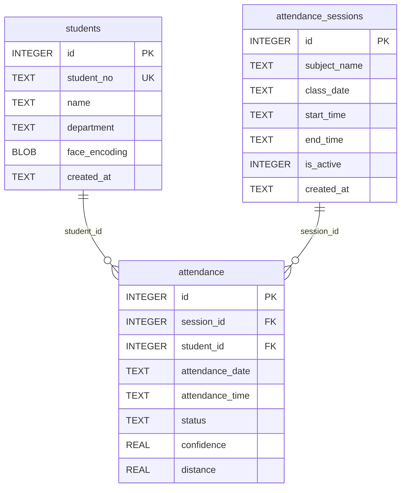

# DB ERD 및 테이블 명세서

작성일: 2026-06-02

대상 DB: `data/students.db`

DBMS: SQLite

스키마 기준:

- 코드 정의: `modules/database.py`
- 실제 확인: `PRAGMA table_info`, `PRAGMA index_list`, `PRAGMA foreign_key_list`

현재 업무 테이블:

- `students`
- `attendance_sessions`
- `attendance`

## 1. ERD



관계:

| 관계 | 설명 |
| --- | --- |
| `students.id` 1 : N `attendance.student_id` | 한 학생은 여러 세션에 출석 기록을 가질 수 있다. |
| `attendance_sessions.id` 1 : N `attendance.session_id` | 한 출석 세션은 여러 학생의 출석 기록을 가진다. |
| `attendance(session_id, student_id)` unique | 같은 세션에서 같은 학생은 한 번만 출석 처리된다. |

## 2. 테이블 요약

| 테이블 | 설명 | 현재 row 수 |
| --- | --- | --- |
| `students` | 학생 기본 정보와 얼굴 임베딩 저장 | 1 |
| `attendance_sessions` | 과목/수업 일자 단위 출석 세션 저장 | 4 |
| `attendance` | 학생별 출석 처리 결과 저장 | 1 |

## 3. `students`

학생 기본 정보와 FaceNet 얼굴 임베딩을 저장한다.

DDL:

```sql
CREATE TABLE IF NOT EXISTS students (
    id INTEGER PRIMARY KEY AUTOINCREMENT,
    student_no TEXT UNIQUE NOT NULL,
    name TEXT NOT NULL,
    department TEXT,
    face_encoding BLOB NOT NULL,
    created_at TEXT NOT NULL
);
```

컬럼 명세:

| 컬럼 | 타입 | NULL | 기본값 | 키 | 설명 |
| --- | --- | --- | --- | --- | --- |
| `id` | INTEGER | 허용 | 없음 | PK | 학생 내부 ID, autoincrement |
| `student_no` | TEXT | 불가 | 없음 | UK | 학번, 중복 불가 |
| `name` | TEXT | 불가 | 없음 |  | 학생 이름 |
| `department` | TEXT | 허용 | 없음 |  | 학과 |
| `face_encoding` | BLOB | 불가 | 없음 |  | FaceNet 얼굴 임베딩 bytes |
| `created_at` | TEXT | 불가 | 없음 |  | 생성 시각, ISO 문자열 |

인덱스:

| 인덱스 | Unique | 컬럼 | 설명 |
| --- | --- | --- | --- |
| `sqlite_autoindex_students_1` | Y | `student_no` | `student_no UNIQUE` 제약으로 자동 생성 |

주요 사용처:

- `POST /students`: 학생 등록
- `POST /attendance/recognize`: 등록 얼굴 임베딩 조회 및 학생 정보 반환
- Admin CLI 학생 등록/목록 조회

## 4. `attendance_sessions`

과목과 수업 날짜 기준의 출석 세션을 저장한다.

DDL:

```sql
CREATE TABLE IF NOT EXISTS attendance_sessions (
    id INTEGER PRIMARY KEY AUTOINCREMENT,
    subject_name TEXT NOT NULL,
    class_date TEXT NOT NULL,
    start_time TEXT,
    end_time TEXT,
    is_active INTEGER DEFAULT 1,
    created_at TEXT NOT NULL
);
```

컬럼 명세:

| 컬럼 | 타입 | NULL | 기본값 | 키 | 설명 |
| --- | --- | --- | --- | --- | --- |
| `id` | INTEGER | 허용 | 없음 | PK | 출석 세션 ID, autoincrement |
| `subject_name` | TEXT | 불가 | 없음 |  | 과목명 |
| `class_date` | TEXT | 불가 | 없음 |  | 수업 일자, `YYYY-MM-DD` |
| `start_time` | TEXT | 허용 | 없음 |  | 수업 시작 시간 |
| `end_time` | TEXT | 허용 | 없음 |  | 수업 종료 시간 |
| `is_active` | INTEGER | 허용 | `1` |  | 활성 여부. 1은 활성, 0은 비활성 |
| `created_at` | TEXT | 불가 | 없음 |  | 생성 시각, ISO 문자열 |

인덱스:

현재 명시 인덱스 없음.

주요 사용처:

- `POST /sessions`: 세션 생성 및 활성화
- `GET /sessions`: 세션 목록 조회
- `GET /sessions/active`: 활성 세션 조회
- `POST /sessions/{session_id}/activate`: 세션 활성화
- `POST /sessions/{session_id}/close`: 세션 종료
- `GET /attendance`: 출석 조회 시 세션 메타데이터 조인

비즈니스 규칙:

- 새 세션 생성 시 기존 활성 세션은 모두 `is_active = 0`으로 변경된다.
- 세션 활성화 시 기존 활성 세션은 모두 비활성화되고 대상 세션만 활성화된다.
- DB 제약으로 활성 세션이 1개만 존재하도록 강제하지는 않는다. 서비스 로직에서 제어한다.

## 5. `attendance`

학생별 출석 기록을 저장한다.

DDL:

```sql
CREATE TABLE IF NOT EXISTS attendance (
    id INTEGER PRIMARY KEY AUTOINCREMENT,
    session_id INTEGER NOT NULL,
    student_id INTEGER NOT NULL,
    attendance_date TEXT NOT NULL,
    attendance_time TEXT NOT NULL,
    status TEXT NOT NULL,
    confidence REAL,
    distance REAL,
    FOREIGN KEY(session_id) REFERENCES attendance_sessions(id),
    FOREIGN KEY(student_id) REFERENCES students(id),
    UNIQUE(session_id, student_id)
);
```

컬럼 명세:

| 컬럼 | 타입 | NULL | 기본값 | 키 | 설명 |
| --- | --- | --- | --- | --- | --- |
| `id` | INTEGER | 허용 | 없음 | PK | 출석 기록 ID, autoincrement |
| `session_id` | INTEGER | 불가 | 없음 | FK, UK | 출석 세션 ID |
| `student_id` | INTEGER | 불가 | 없음 | FK, UK | 학생 ID |
| `attendance_date` | TEXT | 불가 | 없음 |  | 출석 처리 일자 |
| `attendance_time` | TEXT | 불가 | 없음 |  | 출석 처리 시간 |
| `status` | TEXT | 불가 | 없음 |  | 출석 상태. 현재 기본값은 `present` |
| `confidence` | REAL | 허용 | 없음 |  | YOLO 얼굴 검출 confidence |
| `distance` | REAL | 허용 | 없음 |  | FaceNet 임베딩 거리 |

인덱스:

| 인덱스 | Unique | 컬럼 | 설명 |
| --- | --- | --- | --- |
| `sqlite_autoindex_attendance_1` | Y | `session_id`, `student_id` | 같은 세션의 같은 학생 중복 출석 방지 |

외래키:

| 컬럼 | 참조 테이블 | 참조 컬럼 | on_update | on_delete |
| --- | --- | --- | --- | --- |
| `student_id` | `students` | `id` | NO ACTION | NO ACTION |
| `session_id` | `attendance_sessions` | `id` | NO ACTION | NO ACTION |

주요 사용처:

- `POST /attendance/recognize`: 출석 저장
- `GET /attendance`: 출석 목록 조회
- `GET /attendance/today`: 오늘 출석 목록 조회
- `GET /attendance/export`: CSV 다운로드

비즈니스 규칙:

- 출석 상태는 현재 `present`만 저장된다.
- 출석 일자/시간은 서버 로컬 시간 기준으로 저장된다.
- 같은 학생이 같은 세션에 이미 출석했다면 새 row를 만들지 않고 `already_attended`로 응답한다.

## 6. 조회 조인 구조

출석 목록 조회는 `attendance`, `students`, `attendance_sessions`를 조인한다.

```sql
SELECT
    attendance.id,
    attendance.session_id,
    attendance.student_id,
    students.student_no,
    students.name,
    students.department,
    attendance.attendance_date,
    attendance.attendance_time,
    attendance.status,
    attendance.confidence,
    attendance.distance,
    attendance_sessions.subject_name,
    attendance_sessions.class_date,
    attendance_sessions.start_time,
    attendance_sessions.end_time
FROM attendance
JOIN students ON students.id = attendance.student_id
JOIN attendance_sessions ON attendance_sessions.id = attendance.session_id;
```

조회 API 반환 필드는 이 조인 결과를 기반으로 만들어진다.

## 7. 마이그레이션 정책

`modules/database.py`의 `init_db()`는 서버/서비스 호출 시 반복 실행될 수 있으며 다음을 수행한다.

- `students` 테이블이 없으면 생성한다.
- `attendance_sessions` 테이블이 없거나 필수 컬럼이 부족하면 legacy 테이블로 rename 후 현재 스키마로 재생성한다.
- `attendance` 테이블이 없거나 unique/FK/필수 컬럼이 부족하면 legacy 테이블로 rename 후 현재 스키마로 재생성한다.
- 이전 날짜 기반 출석 테이블 구조가 있으면 날짜별 임시 세션을 만들고 출석 기록을 이관한다.

주의:

- 마이그레이션 중 `PRAGMA foreign_keys = OFF`를 사용한다.
- `reset_attendance_tables()`는 개발용이며 `students`는 유지하고 `attendance_sessions`, `attendance`만 초기화한다.
